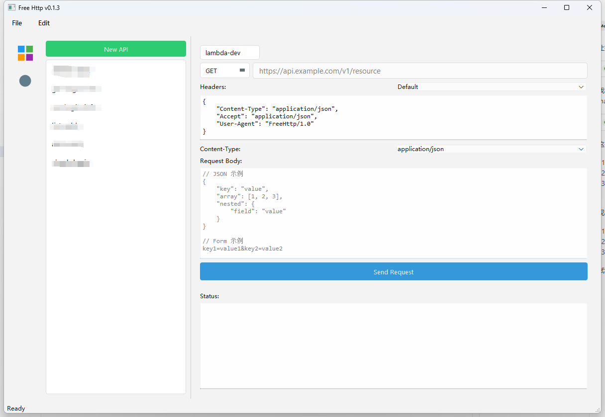

# HTTP Client

一个简单而强大的 HTTP API 请求工具，使用 PyQt6 实现。



## 功能特点

- 支持常用 HTTP 方法（GET, POST, PUT, DELETE, PATCH）
- 可配置请求头，支持自定义 HTTP Headers
- 支持发送各种格式的请求体（JSON, Form Data 等）
- 美观的响应展示，包括：
  - 状态码和状态描述
  - 响应头信息
  - 格式化的响应内容（支持 JSON 自动格式化）
- 域名管理功能，可保存常用域名
- 状态栏实时显示请求状态
- 加载动画提供视觉反馈

## 安装依赖

```bash
pip install -r requirements.txt
```

主要依赖：
- PyQt6: GUI 框架
- aiohttp: 异步 HTTP 客户端
- qasync: PyQt6 的异步支持
- chardet: 响应编码检测

## 开发环境设置

1. 克隆仓库：
```bash
git clone https://github.com/yourusername/free-http.git
cd free-http
```

2. 创建虚拟环境（推荐）：
```bash
python -m venv venv
source venv/bin/activate  # Linux/Mac
venv\Scripts\activate     # Windows
```

3. 安装依赖：
```bash
pip install -r requirements.txt
```

## 运行应用

```bash
python src/main.py
```

## 使用说明

1. **发送请求**：
   - 选择 HTTP 方法（GET, POST 等）
   - 输入目标 URL
   - 根据需要添加请求头和请求体
   - 点击发送按钮

2. **域名管理**：
   - 点击域名管理按钮
   - 可以添加、编辑、删除常用域名
   - 域名会自动去除末尾斜杠

3. **查看响应**：
   - 状态码和描述
   - 响应头信息
   - 格式化的响应内容

## 版本历史

当前版本：v0.1.3

## 贡献指南

欢迎提交 Issue 和 Pull Request！

## 许可证

本项目采用 MIT 许可证。
